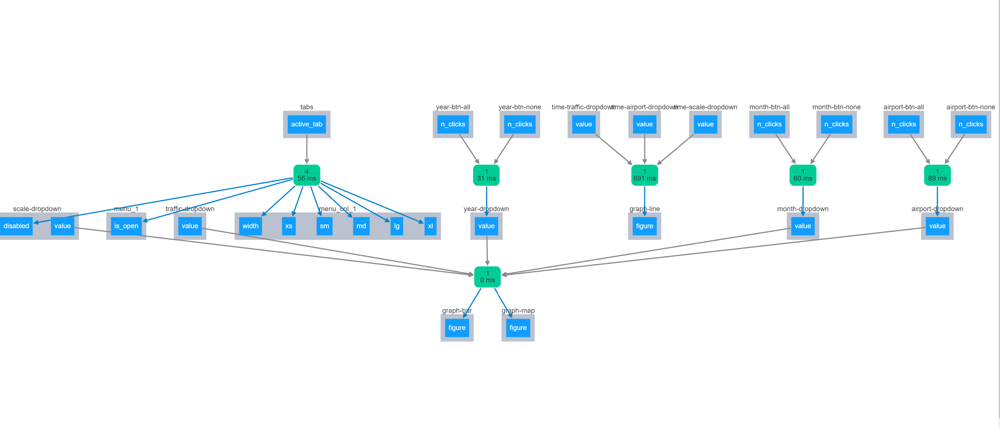

# Dash(board) of Norwegian Flight Data
This project used geo-mapping and plotting to visualize data collected from the [Norway Statistics Website](https://www.ssb.no/en/statbank/table/08507/) in a web dashboard. 


The frameworks used to depict the data: Dash, Plotly, Mapbox studio, Pandas, NumPy, Bootstrap, HTML, Jupyter Notebook and PostgreSQL

For a presentation-style overview of this project, click [here](dash_pdf.pdf).


## Navigating this Repo
The raw dataset that was pulled is called [passenger_data.csv](passenger_data.csv). The cleaned version of the data, obtained from the [data_prep.ipynb](data_prep.ipynb) file, which additionally includes connecting to a PostgreSQL database using psycopg2. The [df_melt.csv](df_melt.csv) file is the cleaned data. A separate Python file for necessary functions was made -- [functions.py](functions.py)

The functional app is called [airport_app.py], and no HTML/CSS/JavaScript files were required as the web framework was created using [Dash](https://dash.plotly.com). This visualization and UI library was used in order to build on previous knowledge of Plotly and Bootstrap as well as maintain the simplicity of a Python app compared to using JS. 

Other files included are those in the **DB** folder, such as:
- [database.ini](database.ini) which has authentication information
- [config.py](config.py) which is used with *database.ini* to allow for database parsing
- [connect.py](connect.py) which defines the ```connect``` function to make contact with the db
- [postgresql.py](postgresql.py) which creates a function to convert the database table to a dataframe in Pandas

## Data Munging and Loading
The following procedures were utilized in order to manipulate the downloaded data:
- Renamed columns and identified missing values
- Added geographic data by merging with another dataframe
    - Manually added missing geo data
- Converted the data format to yyyy/mm/dd
- Loaded df into PostgreSQL database using psycopg2 Python driver
- Loaded data back into dataframe to assure interaction between front and back end

## Application Prep
In the [airport_app.py](airport_app.py) file, the Dash web framework was utilized to create features and visualizations on the web page. The two libraries that were essential for this functionality were ```dash_core_components``` and ```dash_bootstrap_components```. The web page includes a search bar, navbar, buttons, dropdowns, visualizations held in separate tabs.
These visualizations are:
- Geographical
- Categorical
- Time
- Data Table

One aspect of Dash web apps that are essential for interactablility and functionality are [callback functions](https://dash.plotly.com/basic-callbacks). Some functions of these elements include updating the page or toggling tabs.


### Challenges and Final Thoughts
- Issues with loading initially involved simply investigating which data was pulled from the website, as some columns were sums of others. 
- Another challenge was finding unique CSV delimiters to divide the data in columns as some of the data included commas.
- The encoding was unique due to Norwegian characters: **ISO-8859-1**.
- The tactic of separating connection functions and database initialization to different files was a new way of thinking about file structure.

